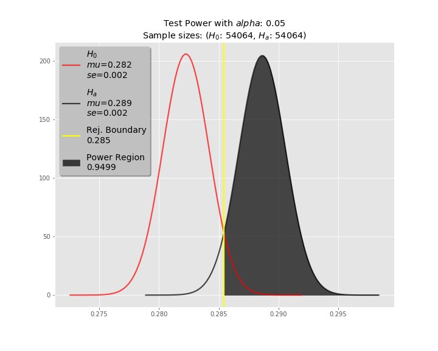

# Stock Indicator Test

## Background
My motivation for this project is to create a reusable test environment to statistically measure the viability of a given trading strategy, the likes of which might be touted by a fanatic YouTuber, an arrogant party guest, or your local barfly. 

In proper nerd fashion, by the power of science, I hope to be able to either: 1) present them with contradictory results in a crowded room, or 2) use the supportive results to achieve world domination, and conveniently forget where the strategy came from. Just kidding. I'd make them a Duke or something.

More practically, this test can be used to compare the results of a Machine Learning model to that of random chance. 

## The Data
* The data was collected from the free tier of the [Alpha Vantage](https://www.alphavantage.co/) API, using the [python wrapper](https://github.com/RomelTorres/alpha_vantage) by Romel Torres 
	* 100 random stock tickers (excluding indexes) from the NASDAQ were selected for testing 	
	* 5-minute timestep intervals, over the past 15 trading days (gathered on 9/11/19 - 9/12/19)
	* Stock Price: Open, High, Low, Close
	* SMA8/SMA13 Indicators: Single numerical value each
* Pandas was used for data manipulation
	* Joining stock prices and their relevant indicators
	* Creating new columns based on the trading conditions for entering and exiting the hypothetical trade
	* Storage/retrieval from PostgreSQL DB

* A pipeline script was built to automate the collection/processing of 200 stocks and their corresponding indicators

## Trading Strategy Conditions
* Fixed exit conditions
	*  +1% or -0.3% relative to purchase price, whichever happens first*
* SMA** entry conditions
	* If the SMA-8 crosses above the SMA-13, purchase at the open price of the following timestep 	

In the image below, the dotted lines indicate entry points as determined by the SMA  entry conditions.

\* For a given timestep, the lower bound condition was checked against the Low for that timestep before any other checks were made, and therefore may have yielded more conservative results than would have occured in real-time. Additionally, the price difference between the Close of one day and the Open of the next could vary widely, and therefore this basic algorithm may not reflect realtime trading as accurately as possible.
\*\*The Simple Moving Average is calculated as the sum of the closing prices of the previous *n* timesteps, divded by the number of timesteps *n*. 
 
## Statistical Test
### Null hypothesis:
Given specific exit conditions for a stock trade, an indicator **will not** perform better than random chance at predicting a winning entry point.   *mu\_0 = mu\_a*

### Alternative hypothesis:
Given specific exit conditions for a stock trade, an indicator **will** perform better than random chance at predicting a winning entry point.   *mu\_0 < mu\_a*

### Model
The mean of successes from the random entries will be used (assuming a normal distribution, as per the CLT) to model the null hypothesis.

### Threshold
A 0.05 significance level will be used.

## Execution
1. The data was iterated through sequentially with the stated conditions to check for indicated entry points.
2. Based on the number of *indicated* entry points over each 15-day timeframe, a comparable (+/-10%) number of *random* entry points was generated across the same timeframe.
	* Each entry point was considered one observation 
3. All entries were checked to statisfy the fixed exit conditions, and the wins and losses were recorded.
	* This resulted in 2 Bernoulii distributions
4. A one-tailed, independent samples t-test was used to compare the mean of the two distributions

## Results

|      |   n   |   mu   |   se
|------|-------|--------|------
|Random| 2930  | 0.2823 |0.00832
|SMA   | 2976  |0.2886  |0.00831
\*Out of 63,237 collected timesteps

### p-value: 0.587
### Conclusion
As the p-value is not less than the significance region of 0.05, we fail to reject the null hypothesis.

### Test Power
This was a low powered test:

However, if we were to treat this run as a sample, and go on to collect a larger dataset that achieves a higher power, then the minimum sample size needed to achieve: 

* 0.95 power
* 0.006 effect size
* 0.05 alpha

is 54,064 samples

## Improvements
* Refactor the pipeline script to follow best practices
	* Isolate individual functions
	* Add logging
	* Modular code for different test conditions
* Refine the schema of the Postgres database
* Include 4398 observations from NYSE, after removing ETFs
* Include conditions for inter-day trades
* Create simulations for use in a portfolio subject to fees/commissions
