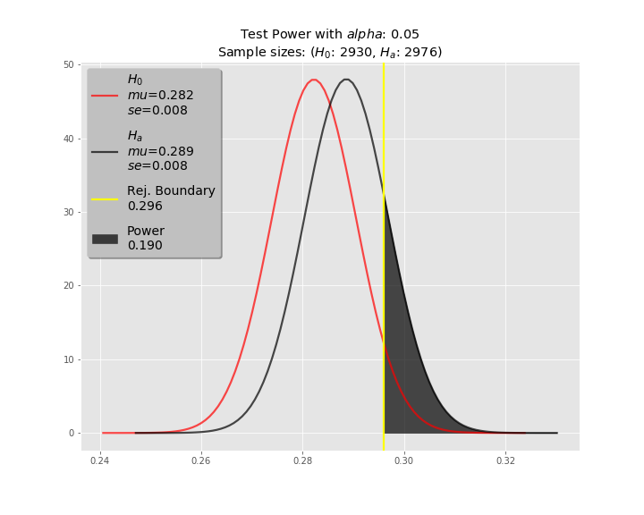

# Stock Indicator Test

## Introduction
My motivation for this project is to create a reusable test environment to statistically measure the viability of a given trading strategy, the likes of which might be touted by a fanatic YouTuber, an arrogant party guest, or your local barfly. 

In proper nerd fashion, by the power of science, I hope to be able to either: 1) present them with contradictory results in a crowded room, or 2) use the supportive results to achieve world domination, and conveniently forget where the strategy came from. Just kidding. I'd make them a Duke or something.

More practically, this test can also be used to measure the results of a predictive Machine Learning model in the future. 

The trading conditions used for this first pass are intentionally naive, as the focus is to develop the testing framework. They are loosely based on a basic understanding of simple moving averages and stop-losses. They will be tested against random chance for the null hypothesis, but could feasibly be tested against another set of conditions.

## Technologies Used
* Python
* Jupyters
* Pandas
* Scipy
* Matplotlib
* PostgreSQL

## The Data
* The data was collected from the free tier of the [Alpha Vantage](https://www.alphavantage.co/) API, using the [python wrapper](https://github.com/RomelTorres/alpha_vantage) by Romel Torres 
	* 100 random stock tickers (excluding indexes) from the NASDAQ were selected for testing 	
		* 5-minute timestep intervals, over the past 15 trading days (gathered on 9/11/19 - 9/12/19)
			* API limitation (free tier)

* Pandas was used for data manipulation
	* Joining stock prices and their relevant indicators
	* Creating new columns based on the given trading conditions
	* Storage/retrieval from PostgreSQL DB

* A pipeline script was built to automate the collection/processing/storage

Example:


## Trading Strategy Conditions
* Fixed exit conditions
	*  +1% or -0.3% relative to purchase price, whichever happens first*
* SMA** entry conditions
	* If the SMA-8 crosses above the SMA-13, purchase at the open price of the following timestep 	

Visualization of the SMA entry conditions:


\* For a given timestep, the lower bound condition was checked against the Low for that timestep before any other checks were made, and therefore may have yielded more conservative results than would have occured in real-time. Additionally, the price difference between the Close of one day and the Open of the next could vary widely, and therefore this basic algorithm may not reflect realtime trading as accurately as possible.<br>
\*\*The Simple Moving Average is calculated as the sum of the closing prices of the previous *n* timesteps, divded by the number of timesteps *n*. 
 
## Statistical Test
### Null hypothesis:
Given specific exit conditions for a stock trade, an indicator **will not** perform better than random chance at predicting a winning entry point. <br> *mu\_0 = mu\_a*

### Alternative hypothesis:
Given specific exit conditions for a stock trade, an indicator **will** perform better than random chance at predicting a winning entry point. <br> *mu\_0 < mu\_a*

### Model
The mean of successes from the random entries will be used to model the null hypothesis, assuming a normal distribution as per the CLT.

### Threshold
Given my lack of domain knowledge, I will default to the widely accepted 0.05 significance level.

## Execution
1. The data was iterated through sequentially with the stated conditions to check for indicated entry points.
2. Based on the number of *indicated* entry points over each 15-day timeframe, a comparable (+/-10%) number of *random* entry points was generated across the same timeframe.
	* Each entry point was considered one observation 
3. All entries were checked to statisfy the fixed exit conditions, and the wins and losses were recorded.
	* This resulted in 2 Bernoulii distributions
4. A one-tailed, independent samples t-test was used to compare the means of the two distributions

Example code to check exit conditions:

```python
# buy_idxs contains all df indexes that satisfied the SMA entry requirements
for idx in buy_idxs:
    purch_price = df.loc[idx, 'open']
    upper_lim = purch_price * 1.01
    lower_lim = purch_price * 0.997
    for i in range(idx, len(df)):
        if (df.loc[i, ["high", "low", "close"]]<=lower_lim).any():
            break
        elif (df.loc[i, ["high", "low", "close"]]>=upper_lim).any():
            df.at[idx, "sma_win"] = 1
            break

```

## Results

<p align="center">
  
</p>

|      |   n   |   mu   |   se
|------|-------|--------|------
|Random| 2930  | 0.2823 |0.00832
|SMA   | 2976  |0.2886  |0.00831

\*Out of 63,237 collected timesteps


### Conclusion
* p-value: 0.587
	* Given the null hypothesis is true, we can expect to see these results roughly 59% of the time.
	* As the p-value is not less than 0.05, we cannot reject the null hypothesis.
* In a real-world scenario, this would suggest that the proposed algorithm needs to be improved or discarded. However, other factors would also need to be considered, including overall profitability given the specific sell conditions. Specific dollar amounts would need to be attached to the results.

### Test Power
There is a 19% chance we will detect a difference of 0.007 when such a difference actually exists. Therfore, this is a low powered test.



However, if we were to treat this as a sample run, and go on to collect a larger dataset that achieves a higher power, then we would need a minimum sample size of 54,064 to achieve: 

* Power: 0.95
* Effect size: 0.007
* Alpha: 0.05


## Key Takeaways
* The project was a success
	* A pipeline was successfully established between the API and the DB, and the test produced meaningful results
	* This can be applied to different trading conditions in the future
* The data was relatively clean, with very few missing values
	* I might expect the same to be true of similar financial data 
* I experienced significant improvement in the following skills: 
	* Pandas
	* Postgres
	* Scripting
	* Statistics

## Future Improvements
- [ ] Refactor the pipeline script
	- [ ] Isolate individual functions
	- [ ] Add logging
	- [ ] Create more robust and modular environment for testing and trading conditions
- [ ] Refine the schema of the Postgres database
- [ ] Include 4398 observations from NYSE, after removing ETFs
- [ ] Include conditions for inter-day trades
- [ ] Create simulations for use in a portfolio subject to fees/commissions
